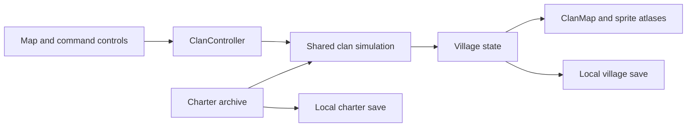

# Clan World

Clan World is a continuous medieval village game in pixel art. You command Elder Aldric and the Mossfell clan: assign workers, carry resources home, raise buildings, recruit clansmen, and collect charters that change village production.

- A 48 x 40 isometric map starts with the Elder and twelve clan members, including a guard. Six workers already gather timber, stone, and food.
- Supplies enter your stockpile when workers deliver their cargo. The economy uses timber, stone, food, iron, and gold.
- Eleven structures are available in the build menu, alongside the existing Elder's hall.
- Nine collectible charters share three production doctrines. One charter can be active at a time.
- Generated buildings, environmental props, ground textures, and 96 unit animation frames form the current art set.
- The game runs locally in your browser. Gold and packs are in-game resources; no payments or crypto services are connected.

## Start the game

Requirements: Node.js 20.9 or newer and pnpm 10.15.1.

```sh
cd "/Users/mikail/Desktop/Clan World/clan-world-new"
pnpm install
pnpm dev
```

Open [Clan World locally](http://localhost:3010). On this Mac, [Play Clan World.command](Play%20Clan%20World.command) opens the running game or starts its development server.

- Gameplay needs no database, API server, environment variables, or account.
- For development access from a physical phone, add the computer's exact local network address to `allowedDevOrigins` in `apps/web/next.config.ts`, restart the server, and use that address on the same network.
- To serve a production build, run `pnpm build`, then `pnpm --filter @clan-world/web start`. Both development and production use port 3010.
- The optional `pnpm dev:api` command starts the Effect API on `127.0.0.1:3011`. Its implemented endpoint is `GET /health`; the village does not call it.

## Run your village

1. Select a clansman on the map or in the Clan roster. Use the Idle filter to find someone available.
2. Choose Timber, Stone, or Harvest in Assign work, or select a resource on the map. The worker travels to it, gathers up to 10 units, delivers the load to a compatible store, and returns to work.
3. Select builders, open Build, choose a structure, and place it on clear land. Workers must reach the foundation before construction advances.
4. Keep the Elder near important work. His inspiration increases nearby gathering and construction speed by 35%. Rally gives a further 30% work bonus for 25 seconds.
5. Build cottages for housing, recruit with food and gold, and shorten delivery routes with local stores.
6. Open earned charter packs and ratify a doctrine that suits your next task.

### In plain words

The clan works like a crew with a shared supply store. An axe swing fills a worker's load, but the village cannot spend that timber until the worker brings it home. Your decisions determine who works, where supplies travel, and which jobs finish first.

## Use the controls

| Action | Mouse or touch | Keyboard |
| --- | --- | --- |
| Select a person | Click or tap the person or roster row | Tab through roster controls |
| Select a group | Drag a box; Shift-click adds people | 1 selects members except the Elder |
| Give an order | Select a resource or destination; right-click also gives orders | Choose a command, then a map target |
| Move | Move, then select a location | M |
| Gather | Work, then select a resource or farm | G |
| Construct | Select builders, open Build, choose a structure, and place it | B opens Build |
| Deliver cargo | Return, or right-click compatible storage | R |
| Follow the Elder | Follow | F |
| Stop orders | Stop | Use the Stop button |
| Queue an order | Hold Shift while issuing a map order | Shift |
| Find the Elder | Find Elder or the Clan World crest | E |
| Pan | Middle-button drag, Space-drag, or touch drag | WASD or arrows |
| Zoom | Mouse wheel, pinch, or map buttons | Use map buttons |
| Pause | Pause button | P |
| Cancel placement or command mode | Placement cancel button | Escape |

- The minimap moves the camera. The center-selection button focuses the selected person.
- On mobile, Clan opens the roster, Build opens construction, Map opens the minimap, and Charters opens the archive. Tap a person before their target; drag the land to pan.
- Each person supports up to 16 queued orders. A queued order after gathering starts after a cargo delivery.
- Simulation speed cycles through 1x, 2x, and 4x. The manual, archive, and pack dialogs pause simulation. Hidden tabs do not advance the village.
- Paths and Names toggle map overlays. Sound and Save are in the bottom status bar.

## Build and collect

| Structure | Implemented purpose |
| --- | --- |
| Clansman's cottage | Adds four housing spaces |
| Woodcutter's lodge | Accepts timber and improves nearby timber gathering |
| Quarry lodge | Accepts stone and iron |
| Wheat field | Supplies regenerating food |
| Watchtower | Provides a watchpost landmark |
| Village well | Restores nearby worker vigour |
| Storehouse | Accepts resources near distant worksites |
| The Hearth & Stag | Raises target clan happiness |
| Blacksmith | Improves all gathering |
| Market stall | Increases passive gold income |
| Stone chapel | Extends the Elder's inspiration radius |

- A recruit costs 30 food and 20 gold and needs an available housing space. The initial village has 13 people and room for 16.
- Population consumes food. Low food reduces happiness. Tired workers gather more slowly; rest, deliveries, and wells restore vigour.
- The archive begins with three sealed packs and The Forester ratified. Every 150 delivered resources earns another pack. You can acquire a pack for 40 gold.
- Break the wax seal with a horizontal drag or the Break seal button. Reveal three charters individually or together. Each pack includes at least one rare or legendary charter.
- One ratified charter supplies a village-wide doctrine: 20% faster gathering, 20% faster construction, or 10% faster movement while carrying cargo. The nine cards share these three effects. Rarity and duplicates do not stack additional bonuses.

## Understand the architecture



### In plain words

The controller takes your orders, the simulation updates the crew and shared store, and the map draws the result. The browser keeps the village and charter book so you can continue later.

| Source | Responsibility |
| --- | --- |
| `apps/web/app/page.tsx` | Mounts `ClanController` |
| `components/medieval/ClanController.tsx` in the web app | Commands, build menu, roster, dialogs, charter rewards, and saving |
| `components/medieval/ClanMap.tsx` in the web app | Camera, hit testing, selection, terrain, depth ordering, and rendering |
| `lib/medieval/sprites.ts` in the web app | Atlas loading and registered animation frames |
| `lib/medieval/charters.ts` in the web app | Charter definitions, archive validation, and pack contents |
| `packages/shared/src/clan-sim.ts` | Pathfinding, orders, cargo, construction, recruitment, production, and saves |
| `apps/api` | Effect HTTP health service |
| `packages/db` | PostgreSQL schema and Drizzle integration through `@effect/sql-drizzle` |

- The simulation receives a 0.1-second tick every 100 milliseconds, multiplied by the selected speed. A separate rendering loop interpolates unit positions.
- A* pathfinding uses eight neighboring cells, avoids buildings, resources, and water, and rejects diagonal steps through blocked corners. New foundations cause routes to be recalculated.
- Unit art contains 32 walking frames, 32 Elder frames, and 32 work frames for chopping, mining, carrying, and construction. Direction mappings and measured foot pivots keep sprites registered.
- Buildings and props use measured clipping rectangles because generated atlas rows vary. Generated ground textures feed cached material patterns.
- Earlier expedition components and their engine remain in the repository but are not mounted by the root page. Their tests and save format are separate.

## Save and resume

| Data | Browser storage key | Save behavior |
| --- | --- | --- |
| Village | `clan-world:elder-village:v2` | Every five seconds, on page exit, and through Save |
| Charters | `clan-world:charters:v2` | When the archive changes |

- The full village save includes resources, people, cargo, orders, queues, buildings, construction progress, elapsed time, and economy statistics. Loading validates data and recalculates transient routes.
- The archive stores copies, packs, the ratified charter, and delivery milestones. Its active doctrine is reapplied to the loaded village.
- New settlement requires a second action, Replace 1 village. It replaces the village while preserving the charter archive.
- Saves belong to one browser origin and device. Use Save before closing if you need an explicit save result.

## Know the limits

- This is a single-player simulation. There are no enemies, combat, raids, multiplayer, shared clan contributions, matchmaking, or verified leaderboards. Watchtowers and the initial guard do not provide a combat system.
- There is no timed match, victory screen, or finished campaign. Hidden or closed pages do not accumulate offline progress.
- The API and database are unused by gameplay. There are no accounts, cloud saves, server authority, or anti-cheat. Local resources and saves can be modified by the player.
- Village and charter records are separate local saves, not a transactional online economy.
- A manifest requests standalone display where supported. No service worker or offline asset cache is included.

## Run checks

```sh
pnpm typecheck
pnpm test
pnpm build
python3 scripts/qa_clan_village.py
```

- Run the current browser script with the game server running. It requires Python Playwright and Chrome; inspect its `--help` output for browser and URL options.
- `clan-sim.test.ts` covers pathfinding, orders, cargo, construction, production modifiers, recruitment, and saves. `pnpm test` also runs retained expedition tests and the API HTTP contract test.
- Workspace typechecking and the production build pass. The test suite passes 36 tests: 13 village tests, 22 retained expedition tests, and one API contract test. Four current browser journeys pass at desktop and mobile sizes with no recorded browser errors. [The playtest notes](docs/PLAYTEST.md) link the evidence and remaining manual checks.
- `pnpm test:e2e` points to a separate TypeScript Playwright configuration. No current village specs are stored in `apps/web/e2e`; use the Python journey suite.
- `scripts/qa_user_journeys.py` and the older `artifacts/qa/REPORT.md` target the retired expedition UI. See [the current playtest notes](docs/PLAYTEST.md) for village checks and recorded results.

## Review artwork provenance

- [World asset provenance](apps/web/public/medieval/PROVENANCE-WORLD.md) records building, prop, and ground texture generation.
- [Unit asset provenance](apps/web/public/medieval/PROVENANCE-UNITS.md) records the 96 frames and atlas registration.
- Current game sprites are original generated assets. Source rectangles and pivots are recorded separately from the PNGs.
- Cinzel and Fragment Mono license notices are included in [the fonts directory](apps/web/public/fonts/).
