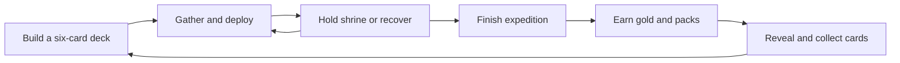

# Clan World

Clan World is a playable pixel-art resource-gathering game powered by collectible cards. You lead Moss & Ember through a three-minute Wildwood expedition against the Ashclaw AI clan, earn rewards, open packs, and rebuild your six-card deck.

- Five game screens: Camp, Wildwood, Collection, Packs, and Clan.
- One original woodland map with resource sites, a contested shrine, and a recovery camp.
- Twelve collectible cards, four rarities, nine clanmates, and three spells.
- Mouse, keyboard, and touch controls, with responsive layouts and optional fullscreen.
- Browser-local progression. All gold and packs are earned or included in the starter profile. There are no payments, wallets, tokens, or crypto integrations.

## Run locally

Requirements: Node.js 20.9 or newer and pnpm 10.15.1.

```sh
cd "/Users/mikail/Desktop/Clan World/clan-world-new"
pnpm install
pnpm dev
```

Open [Clan World locally](http://localhost:3010). The web app binds to `0.0.0.0:3010`. For development access from a physical phone, add the computer's exact local network address to `allowedDevOrigins` in `apps/web/next.config.ts`, restart the server, and use that address on the same network.

On this Mac, double-click [Play Clan World.command](Play%20Clan%20World.command) to open the running game or start the development server.

- `pnpm dev` starts the game on port 3010. Gameplay needs no environment variables or database.
- `pnpm dev:api` starts the separate Effect API on `127.0.0.1:3011`. Its implemented endpoint is `GET /health`.
- `pnpm dev:all` starts the workspace development tasks.
- `pnpm build`, `pnpm typecheck`, and `pnpm test` run the corresponding workspace checks.
- `python3 scripts/qa_user_journeys.py` runs the verified desktop and mobile browser journeys against the running game. It requires Python Playwright and Chrome; use `--chrome` for a different browser executable. `pnpm test:e2e` provides the separate Playwright project configuration for future TypeScript browser tests. See [the playtest notes](docs/PLAYTEST.md).

## Play the loop



### In plain words

Your deck works like a six-tool kit. Pick the right clanmate for a resource, decide when to contest the shrine, and send your warden home before health runs out. A completed expedition gives you more options for the next deck.

### Make tactical decisions

- Tap a destination to move your warden there and gather automatically. Timber scores 1 point per unit, stone scores 2, and essence scores 3.
- Match clanmate affinities to sites for bonus harvests. Crew deployments consume energy, occupy up to four ally slots, expire after their duration, and recharge on individual cooldowns.
- Capture Worldheart by gathering or deploying there. At 65% control, your clan owns the shrine and earns 2 points per second. A Rune Smith deployed there doubles that rate.
- Watch health at dangerous sites. Stoneguard reduces damage, Riverwitch heals through harvesting, and Hearthcamp restores health while your warden rests there.
- Contest an AI rival that travels between sites, consumes the same resource stock, and challenges shrine control. Guards limit rival gains at their site.
- Finish the three-minute expedition with more points than Ashclaw to win. Running out of health or ending the expedition early counts as a loss.

The starter profile includes six cards, three packs, and 120 gold. Each pack contains three cards and guarantees at least one rare or better. Forge another pack for 120 earned gold. Duplicate cards increase the recorded copy count; they do not add combat power.

## Use the controls

| Action | Mouse or touch | Keyboard |
| --- | --- | --- |
| Travel and gather | Select a map site or destination shortcut | Select a destination, then Space |
| Move freely | Select empty terrain | WASD or arrow keys |
| Select a card | Select a card in your hand | 1 through 6 |
| Deploy a selected card | Select a site, or use Deploy card for the selected site | Space |
| Pause or resume | Pause button, then Resume expedition | Escape |
| Zoom | Map + and minus buttons | Use the map buttons |
| Open a pack | Drag horizontally across the pack, or use Rip pack | Focus Rip pack and press Enter |
| Inspect or replace a card | Open Collection, select a card, then Add to deck | Tab and Enter through the controls |

- The destination shortcuts remain available when the mobile camera crops distant parts of the map.
- Selecting a card and then a destination deploys the card. Select the destination before the card if you also want the warden to travel there.
- Returning to Camp from the pause menu preserves the expedition in memory. Enter the Wildwood becomes Resume expedition.
- Hiding the browser tab pauses the expedition. Sound and fullscreen controls are in the Camp header. Help opens the field guide.
- Ending an expedition requires a second action labeled `End 1 expedition`.

## Understand the implementation

| Area | Implementation |
| --- | --- |
| `apps/web` | Next.js and React game shell, screen navigation, controls, CSS card presentation, and Web Audio effects |
| `apps/web/components/WorldCanvas.tsx` | Canvas scenery, animated pixel characters, environmental effects, camera, and pointer coordinate conversion |
| `packages/shared` | Typed cards, pure simulation transitions, seeded random generator, progression, packs, and save validation |
| `apps/api` | Effect HTTP API with a health endpoint |
| `packages/db` | PostgreSQL schema and Drizzle integration through `@effect/sql-drizzle` |

- The client calls the shared simulation every 100 milliseconds during active play. Rendering runs separately through `requestAnimationFrame`.
- Each expedition receives a seed. The AI uses a deterministic random generator, so engine tests can reproduce rival decisions. The normal UI starts fresh seeds and does not expose replay controls.
- Profile changes save to `localStorage` under `clan-world:v1`. Saved data includes collection counts, deck, gold, packs, XP, wins, trophies, and best score. Invalid stored data is normalized or replaced with a starter profile.
- Completed run identifiers prevent a result from being claimed twice through the normal save flow. This is a local consistency check, not a security boundary.
- The browser does not call the API or database for gameplay. The database schema and service are foundations for future development.

## Know the limits

- This is a single-player prototype with a simulated rival. It has no multiplayer, matchmaking, shared clan contributions, live leaderboard, or server-authoritative simulation.
- Profiles belong to one browser origin and device. There are no accounts, cloud saves, or cross-device synchronization. Active expeditions are not persisted across reloads.
- Local saves and scores can be modified by the player. There is no anti-cheat or verified competitive ranking.
- Share challenge sends result text through the device share sheet or clipboard. It does not create a verified score or a replay link.
- The map uses procedural scenery and animated pixel characters. Movement is direct between targets; collision-aware pathfinding and a full directional sprite library are not implemented.
- Fullscreen, sound, and native sharing depend on browser support. A native installer, service worker, and offline installation flow are not included.

## Check the build

- Workspace typechecking passes.
- Twenty-two shared engine and profile tests pass, including travel, rival stock depletion, active-play balance, pack guarantees, deck validation, save recovery, and reward claims.
- One API HTTP contract test passes.
- Three browser journeys pass in headless Chrome at desktop and mobile sizes: packs/decks/persistence, expedition/pause/rewards/replay, and mobile camp recovery. See [recorded evidence](artifacts/qa/REPORT.md) and [the remaining manual checks](docs/PLAYTEST.md).

## Review asset provenance

- The woodland background and twelve-portrait atlas are newly generated for this project. [Exact prompts and provenance](apps/web/public/art/PROMPTS.md) record their creation.
- Map scenery and character drawing are implemented in Canvas code.
- Cinzel and Fragment Mono font license notices are bundled in [the fonts directory](apps/web/public/fonts/).
